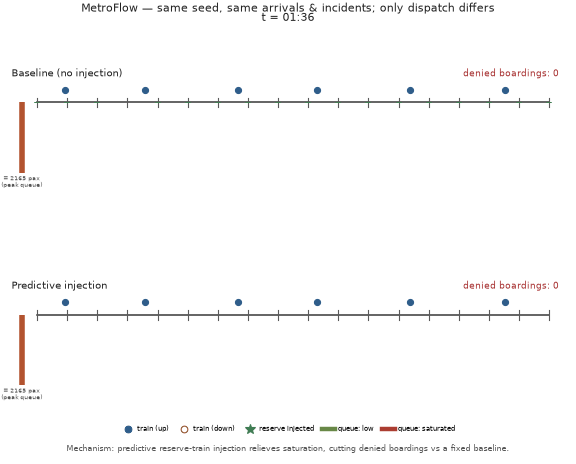
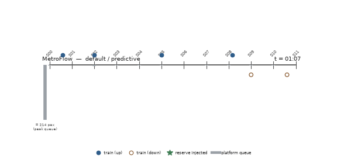
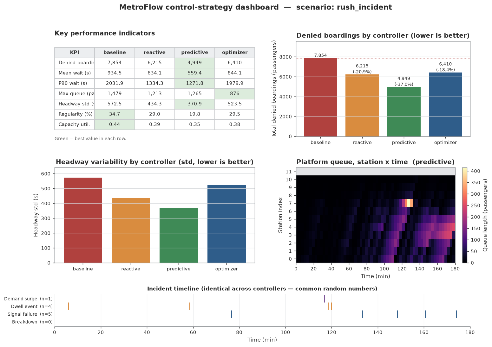
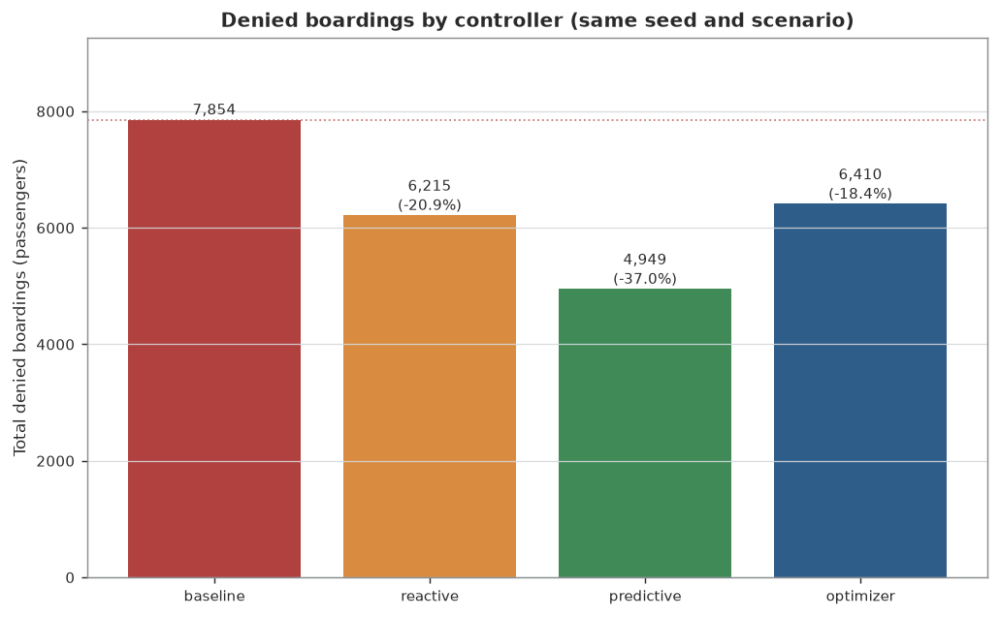
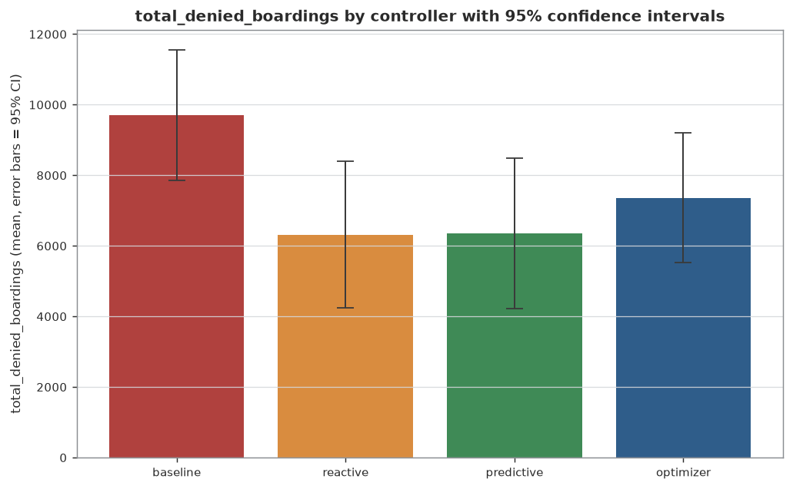
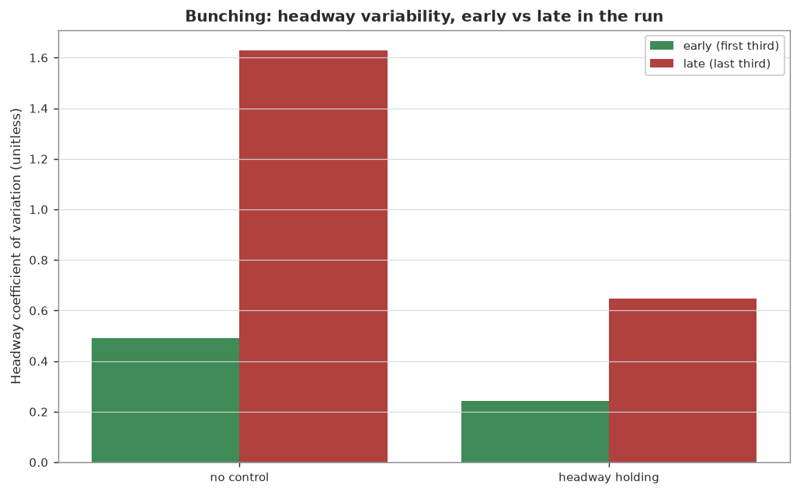
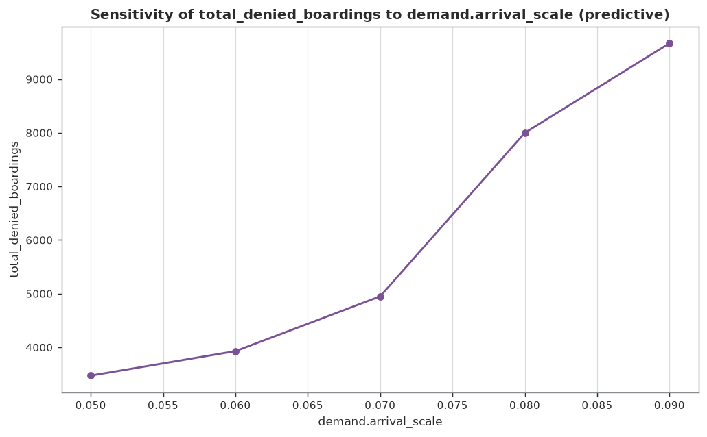
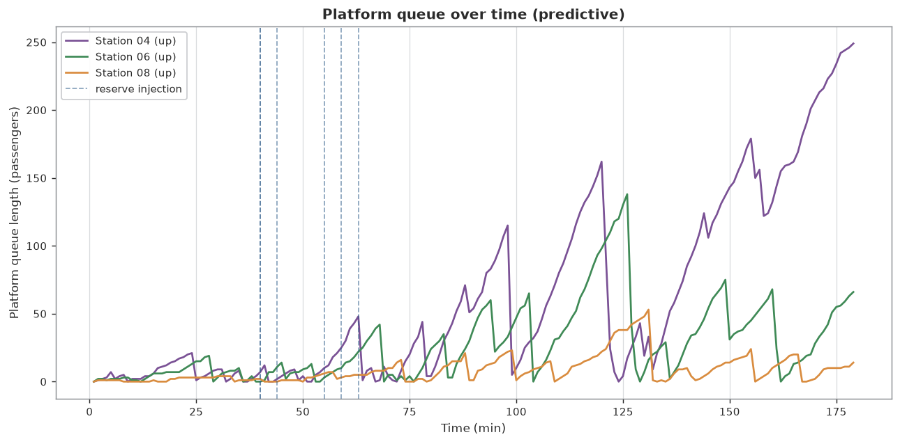

# MetroFlow

MetroFlow — a discrete-event metro-line simulator with CBTC-style safe-separation
signalling, stochastic incidents, and reserve-train dispatch by heuristic *and*
mixed-integer optimisation, with Monte-Carlo validation.



*The core idea, side by side (heavy `rush_incident` scenario, seed 42). **Both
panels run the same seed**, so passenger arrivals and incidents are identical —
only the dispatch strategy differs. Top: a fixed **baseline** that never adds
trains. Bottom: **predictive reserve-train injection** (green stars mark reserves
entering service). Platform-queue bars share a green→amber→red severity scale, and
each panel's live **denied-boardings** counter shows the baseline racing ahead
while predictive stays far lower. Same run, one mechanism, a visible gap.
Regenerate with `metroflow animate --compare` or `examples/generate_examples.py`.*



*A sober schematic of one run (default scenario, predictive controller): stations
are ticks along the line, filled dots are up-line trains and open dots down-line,
each station's grey bar is its platform queue, and a green star marks a reserve
train being injected. Generated by `examples/generate_examples.py`.*



*One-glance summary of a `compare` run on the heavy `rush_incident` scenario
(seed 42, four controllers): a KPI table with the best value per row highlighted,
denied boardings (with % vs baseline) and headway regularity by controller, a
station×time platform-queue heatmap for the best controller, and a full-width
incident timeline (shared across controllers via common random numbers) that
explains the spikes. Also produced by `examples/generate_examples.py`.*

---

> **What this is.** An engineering and simulation showcase built on
> [SimPy](https://simpy.readthedocs.io/). It models a metro line under
> time-varying demand, random incidents and a physical safe-separation
> (signalling) constraint, and compares reserve-train dispatch strategies —
> including a real MILP controller (OR-Tools CP-SAT) — with Monte-Carlo
> confidence intervals and model-validation checks.
>
> **What this is not.** It makes **no novelty claim**. Moving-block/CBTC
> separation, reserve-train (gap-train) injection, MILP dispatch and headway
> holding are all established rail-operations practice and well-studied
> operations-research topics. MetroFlow reimplements these ideas cleanly for
> demonstration and education; it proposes no new method and is **not validated
> against a real network**. Every real-world figure in the code and data is
> sourced or explicitly marked approximate/illustrative.

## Concept

A line has `N` stations in sequence and two running directions; trains run to a
terminus, reverse, and run back, and are pre-positioned evenly around the loop at
service start. A depot holds a pool of reserve trains. Passengers arrive at each
platform following a time-varying demand profile and pick an
attraction-weighted destination, which fixes their direction. Trains have finite
capacity: they alight and board at each stop, dwell for a time that grows with
boarding volume, and leave behind anyone who cannot fit (a *denied boarding*).

Two physical mechanisms make the dynamics realistic:

- **Safe separation (signalling).** A following train may not close on its
  leader below a minimum safe separation. In moving-block/CBTC mode that
  separation is derived from kinematics (braking distance + reaction + margin);
  in fixed-block mode it is quantised to physical block sections. This is what
  makes bunching and injection behave realistically.
- **Load-dependent dwell.** Heavy boarding lengthens dwell, which lets trains
  fall behind and bunch, which degrades headway further — the classic positive
  feedback behind train bunching.

A **controller** watches the line and may **inject** a reserve train from the
depot. MetroFlow ships four controllers — a fixed baseline, a reactive
threshold, a predictive forecaster, and a rolling-horizon **MILP optimiser** —
and lets you compare them on the same seed, or over many seeds with confidence
intervals.

## Install

```bash
pip install .
# or, for development:
pip install -e .
```

Python 3.11+. Dependencies: `simpy`, `numpy`, `matplotlib`, `pyyaml`,
`ortools` (CP-SAT), `scipy`, `pillow` (GIF animation). Matplotlib runs on the
headless `Agg` backend, so plotting and animation work without a display.
`pillow` is imported lazily by the animation module, so the core simulator runs
even if it is absent.

## Usage

```bash
# one controller over a scenario
metroflow simulate --scenario scenarios/default.yaml --controller predictive --seed 42

# compare controllers on the same seed (add the optimiser with --controllers)
metroflow compare --scenario scenarios/rush_incident.yaml --seed 42 \
    --controllers baseline,reactive,predictive,optimizer --plots out/

# Monte-Carlo: N seeded replications per controller, with 95% confidence intervals
metroflow experiment --scenario scenarios/rush_incident.yaml \
    --controllers baseline,reactive,predictive,optimizer --replications 30 --seed 42

# run one controller and dump its figures
metroflow plot --scenario scenarios/default.yaml --controller predictive --plots out/
```

Everything is runnable as a module: `python -m metroflow compare ...`.
Controllers: `baseline`, `reactive`, `predictive`, `optimizer`. Scenarios are
plain YAML (see [`scenarios/`](scenarios)); omitting `--scenario` uses built-in
defaults.

> **Note on the `optimizer` controller's cost.** The `optimizer` solves a CP-SAT
> mixed-integer model on a **rolling horizon** — one solve *per control poll* —
> so it is far slower than the three heuristics (which are O(stations) per poll).
> A single `simulate` run is still quick, but `compare`/`experiment` that include
> `optimizer` take **minutes** rather than seconds. Each solve is hard
> time-bounded (`opt_max_solve_seconds`, default 2 s) with a heuristic fallback,
> so it can never hang — it is just heavier. Leave `optimizer` out of the
> controller list for fast iteration.

## Animation

`metroflow animate` renders a **short, sober** GIF of a single run — a schematic
you could drop into an engineering report, not a marketing clip. Stations are
ticks along a horizontal axis, trains are dots moving in both directions, each
station shows a small platform-queue bar, and a reserve-train injection produces
a brief green-star marker; a clock labels the time.

```bash
metroflow animate --scenario scenarios/default.yaml --controller predictive \
    --seed 42 --out out/run.gif --seconds 8 --fps 10

# split-screen: baseline vs predictive on the same seed (the hero GIF above)
metroflow animate --scenario scenarios/rush_incident.yaml --compare \
    --seed 42 --out out/comparison.gif --seconds 7 --fps 8
```

The `--compare` flag renders the split-screen story shown at the top: two stacked
panels (baseline on top, predictive below) driven by the **same seed**, so
arrivals and incidents are identical and only the dispatch differs. Queue bars use
a shared green→amber→red severity scale and each panel carries a live
denied-boardings counter, making the mechanism's effect legible frame by frame.

It uses matplotlib's `FuncAnimation` with the Pillow writer on the headless `Agg`
backend. The GIFs are intentionally small (low resolution, few downsampled frames —
the committed single-run example is ~0.2 MB and the two-panel comparison ~0.4 MB).
Pillow is imported lazily, so the core simulator works without it; the `animate`
command prints a clear message if Pillow is missing (`pip install pillow`, or
`pip install -e .[animate]`). The committed
[`examples/comparison_animation.gif`](examples/comparison_animation.gif) (the hero
image) and [`examples/line_animation.gif`](examples/line_animation.gif) are both
produced by `examples/generate_examples.py`.

## Building a line from GTFS

MetroFlow can build a line from real open-transit data in the standard **GTFS**
format instead of a YAML `line:` block. `metroflow/gtfs.py` parses the core files
(`stops.txt`, `routes.txt`, `trips.txt`, `stop_times.txt`) with the Python
standard library only, and turns one `route_id`/`direction_id` into an ordered
list of stations with approximate inter-station run-times inferred from the
timetable.

```bash
# inspect the routes/stops in a feed
metroflow gtfs-info examples/gtfs_sample

# build the line from GTFS and simulate it (demand from scenario defaults)
metroflow simulate --gtfs examples/gtfs_sample --route M1 --direction 0 --seed 42
```

A tiny, hand-authored, clearly-illustrative sample ships under
[`examples/gtfs_sample/`](examples/gtfs_sample) (six fictional stations, one metro
route, both directions) so tests and the demo run offline — **it is not real
data**. To use a **real** feed, download one yourself (feeds are large and are
deliberately *not* vendored here) and point MetroFlow at it with
[`scripts/fetch_gtfs.py`](scripts/fetch_gtfs.py):

```bash
python scripts/fetch_gtfs.py <GTFS_ZIP_URL> --dest data/idfm_gtfs
metroflow gtfs-info data/idfm_gtfs
metroflow simulate --gtfs data/idfm_gtfs --route <route_id> --direction 0
```

You can also **freeze** a feed's route into a self-contained scenario file with
`gtfs-export` — the line (station list and per-segment run-times averaged over
every trip in the timetable) is real; demand, incidents and fleet are inherited
from the base scenario and stay synthetic (GTFS describes service, not
passenger counts — the generated header states exactly which is which):

```bash
metroflow gtfs-export data/tisseo_gtfs --route line:61 --direction 0 \
    --name toulouse_line_a --source "GTFS Tisséo, data.gouv.fr, ODbL" \
    --out scenarios/toulouse_line_a.yaml
```

### Real lines shipped as scenarios

Twelve ready-to-run scenarios were generated this way from real French
open-data GTFS feeds (Licence ODbL, via
[transport.data.gouv.fr](https://transport.data.gouv.fr)) — eight metro lines
across four cities, plus four heavy-rail lines (RER, Intercités, TER) that
stretch the simulator to ~70-minute end-to-end runs:

**Metro**

| Scenario | Line | Stations | Feed |
|---|---|---|---|
| [`toulouse_line_a.yaml`](scenarios/toulouse_line_a.yaml) | Toulouse Métro **A** (Basso Cambo → Balma-Gramont) | 18 | Réseau urbain Tisséo |
| [`toulouse_line_b.yaml`](scenarios/toulouse_line_b.yaml) | Toulouse Métro **B** (Ramonville → Borderouge) | 20 | Réseau urbain Tisséo |
| [`rennes_line_a.yaml`](scenarios/rennes_line_a.yaml) | Rennes Métro **a** (J.F. Kennedy → La Poterie) | 15 | Réseau urbain STAR |
| [`rennes_line_b.yaml`](scenarios/rennes_line_b.yaml) | Rennes Métro **b** (Cesson-Viasilva → Saint-Jacques - Gaîté) | 15 | Réseau urbain STAR |
| [`lyon_line_a.yaml`](scenarios/lyon_line_a.yaml) | Lyon Métro **A** (Perrache → Vaulx-en-Velin La Soie) | 14 | Réseau urbain TCL |
| [`lyon_line_d.yaml`](scenarios/lyon_line_d.yaml) | Lyon Métro **D** (Gare de Vaise → Gare de Vénissieux) | 15 | Réseau urbain TCL |
| [`lille_line_1.yaml`](scenarios/lille_line_1.yaml) | Lille Métro **1** (4 Cantons → CHU Eurasanté) | 18 | Réseau urbain ilévia |
| [`lille_line_2.yaml`](scenarios/lille_line_2.yaml) | Lille Métro **2** (C.H. Dron → St. Philibert) | 44 | Réseau urbain ilévia |

**Heavy rail** (much longer lines — RER A is Europe's busiest)

| Scenario | Line | Stations | ~Run | Feed |
|---|---|---|---|---|
| [`rer_a.yaml`](scenarios/rer_a.yaml) | **RER A** (Marne-la-Vallée–Chessy → Cergy-le-Haut) | 27 | 72 min | SNCF Transilien |
| [`rer_b.yaml`](scenarios/rer_b.yaml) | **RER B** (Aéroport CDG 2 → Saint-Rémy-lès-Chevreuse) | 40 | 73 min | SNCF Transilien |
| [`intercites_paris_tours.yaml`](scenarios/intercites_paris_tours.yaml) | **Intercités** Paris Austerlitz → Tours | 10 | 74 min | Réseau SNCF TGV/IC/TER |
| [`ter_marseille_hyeres.yaml`](scenarios/ter_marseille_hyeres.yaml) | **TER** Hyères → Marseille Saint-Charles | 17 | 66 min | Réseau SNCF TGV/IC/TER |

```bash
metroflow compare --scenario scenarios/rer_b.yaml --seed 42
```

Station lists and run-times in those files are timetable-derived; the demand
profiles are **not** real ridership. For branched lines (RER A/B), MetroFlow
models a single corridor: the export picks the feed's most complete trip, i.e.
**one** branch combination — the scenario header names the exact termini.
`scenarios/paris_line1.yaml` remains a hand-calibrated approximation (see its
header).

Real open-data sources (cited in `metroflow/gtfs.py`):

- Île-de-France Mobilités (IDFM), via transport.data.gouv.fr:
  <https://transport.data.gouv.fr/datasets/reseau-urbain-et-interurbain-dile-de-france-mobilites>
- RATP open data: <https://www.ratp.fr/en/ratp-and-open-data>
- Réseau urbain Tisséo (Toulouse) and Réseau urbain STAR (Rennes), via
  <https://transport.data.gouv.fr> (Licence ODbL)

### Example comparison output

`compare` on `rush_incident` (seed 42, 12 stations, 3-hour window, 6 initial
trains + 5 reserves, moving-block signalling, incidents on):

```
MetroFlow comparison  scenario=rush_incident  seed=42
Metric                        baseline      reactive    predictive     optimizer
------------------------  ------------  ------------  ------------  ------------
Denied boardings                  7854          6215          4949          6410
Mean wait (s)                   934.55        634.06        559.36        844.08
P90 wait (s)                   2031.91       1334.31        1271.8       1979.93
Max queue                       1479.0        1213.0        1265.0         876.0
Headway std (s)                 572.55        434.28        370.91         523.5
EJT proxy (s)                   788.12        492.07        420.96        704.21
Lost cust. hours               3092.27       2578.39       2127.98        3408.9
Regularity (%)                    34.7          29.0         19.83         29.46
Signal holds                        61           155           205           190
Reserves used                        0             5             5             5
```

All three active controllers cut denied boardings versus the fixed baseline. The
exact numbers depend on seed and scenario; the point is the *ordering* and the
trade-offs the model deliberately does not hide — e.g. here injection reduces
denied boardings and wait but can *worsen* headway regularity, because inserting
a train perturbs the running timetable. A single seed is only an anecdote, which
is what the `experiment` mode is for.

> **`rush_incident` is deliberately the predictive controller's best case.** It
> is a heavy, surge-and-incident scenario where forecasting the hotspot pays off.
> To keep the framing honest: **no controller is universally best** — the right
> choice depends on the scenario and on which metric you optimise. On the milder
> `default.yaml` (seed 42) the **reactive** controller *beats* predictive:
>
> ```
> compare  scenario=default  seed=42
> Metric                        baseline      reactive    predictive
> Denied boardings                  2087           668          1629
> Mean wait (s)                    679.0        470.61        541.72
> EJT proxy (s)                   544.31        342.37         412.8
> Lost cust. hours               1435.81        856.81       1136.68
> ```
>
> Here reactive denies ~59% fewer boardings than predictive. Predictive's EWMA
> forecast helps under sharp surges (`rush_incident`) but can over- or
> mis-time injections when demand is smooth, whereas the reactive threshold
> simply fires when a queue is already large. Reproduce with
> `metroflow compare --scenario scenarios/default.yaml --seed 42`.

### Statistical comparison (Monte-Carlo)

`experiment` on `rush_incident`, 20 replications, base seed 42 — denied
boardings, mean ± 95% CI, with a Welch's t-test against the baseline:

```
Metric                        baseline            reactive          predictive           optimizer
Denied boardings       9003.4+/-1147.4     5542.1+/-1268.9     5732.7+/-1263.4     6636.1+/-1186.8

Significance of Denied boardings vs baseline (Welch's t-test, alpha=0.05):
  reactive    delta=-3461.3 (-38.4%)  t=-4.23  p=0.0001418  -> SIGNIFICANT; CIs disjoint
  predictive  delta=-3270.7 (-36.3%)  t=-4.01  p=0.0002762  -> SIGNIFICANT; CIs disjoint
  optimizer   delta=-2367.3 (-26.3%)  t=-3.00  p=0.004729   -> SIGNIFICANT; CIs disjoint
```

Every controller's reduction is statistically significant (p < 0.005, and the
confidence intervals are disjoint from the baseline). The controllers are *not*
separable from one another at 20 replications — their CIs overlap — and the
report says so rather than over-claiming a winner. Common random numbers (the
same seeds across controllers) make this test conservative.

### Example figures

Generated by `python examples/generate_examples.py`:

Denied boardings by controller | Denied boardings with 95% CI (Monte-Carlo)
:---:|:---:
 | 

Bunching (headway CV grows without control, holding suppresses it) | Sensitivity to demand
:---:|:---:
 | 

Queue growth with injection moments (predictive) — dashed lines mark reserve injections:



## Signalling model

`signalling.py` replaces the v1 "trains never collide" assumption with a
minimum-safe-separation constraint enforced by the engine: a following train
holds at the platform rather than closing on its leader below the safe
separation. Two regimes are selectable per scenario.

**Moving block (CBTC).** The minimum safe separation is derived from kinematics:

```
separation(v) = v · t_reaction  +  v² / (2·a_service)  +  safety_margin  +  train_length
```

so it *scales with speed* and the implied minimum time headway `separation/v` is
not a constant. This is the mechanism by which CBTC achieves shorter headways
than fixed block.

**Fixed block.** The line is divided into physical block sections of length
`block_length_m`; a block holds at most one train and a follower must keep
`n_clear` empty block(s) behind its leader, so separation is quantised to block
boundaries and independent of speed.

Illustrative separation and implied minimum headway (margin 50 m, decel
1.0 m/s², train 90 m, 500 m blocks):

| speed | moving-block separation | moving-block headway | fixed-block separation | fixed-block headway |
|---|---|---|---|---|
| 8 m/s  | 188 m | 23.5 s | 590 m | 73.8 s |
| 14 m/s | 266 m | 19.0 s | 590 m | 42.1 s |
| 20 m/s | 380 m | 19.0 s | 590 m | 29.5 s |

The functions (`braking_distance`, `min_safe_separation`,
`min_moving_block_headway`, `block_index`, `fixed_block_clear`) are pure and
unit-tested in `tests/test_signalling.py`. Background: the braking-curve
separation is textbook mechanics; CBTC performance separation is specified in
IEEE 1474.

## Optimization (MILP via OR-Tools CP-SAT)

`controllers/optimizer.py` poses reserve-train dispatch as a small mixed-integer
program solved on a **rolling horizon** (model-predictive control): each poll it
re-forecasts demand, solves for the best injection plan over the next `K` steps,
and executes only the first step. The solve time is hard-bounded
(`opt_max_solve_seconds`); on timeout, infeasibility or any build error it falls
back to the predictive heuristic, so it can never hang or crash a run.

Decision variables
- `y[t,c] ∈ {0,1}` — inject a reserve at step `t`, candidate `c = (station, direction)`.
- `a[t,c,p] ≥ 0` — passenger relief allocated by that injection to platform `p`.
- `denied[p] ≥ 0` — residual denied boardings at platform `p`.

Constraints
1. demand balance `denied_p ≥ deficit_p − Σ a[·,·,p]`;
2. link / coverage `a ≤ cap·y` and `a = 0` where the candidate does not reach `p`;
3. one train's relief budget `Σ_p a[t,c,p] ≤ cap`;
4. depot reserve `Σ y ≤ reserves_available`;
5. one injection per step, and spacing `Σ y ≤ 1` over each `min_injection_gap` window;
6. headway/turnaround feasibility `in_service + Σ y ≤ ⌊cycle / effective_min_headway⌋`,
   where the effective minimum headway is the larger of the configured minimum
   and the **moving-block headway from the signalling model** (Axis 1 feeds the optimiser).

Objective: minimise `w_denied·Σ denied` `+ w_injection·Σ y`
`+ w_headway·Σ reg_cost(c)·y` — the last term penalises injecting into an
already-even gap (which would create bunching) and is cheap where the gap is
stretched. The horizon deficit forecast is a deliberately simple linear
surrogate — per-platform backlog plus forecast arrivals minus the free capacity
recently observed at that platform — and is documented as such in the docstring.
Unit and integration tests are in `tests/test_optimizer.py`.

**The MILP is not a silver bullet, and this repo does not pretend otherwise.**
On these scenarios the CP-SAT optimiser **does not dominate the simple
heuristics** — it frequently does *worse* on denied boardings (e.g. 6410 vs the
predictive heuristic's 4949 on `rush_incident` above, seed 42). That is expected,
and there are honest reasons for it: (1) it optimises a **myopic rolling horizon**
and executes only the first step, so it lacks the long look-ahead that would
justify its machinery; (2) it plans against a **forecast** (a deliberately simple
linear deficit surrogate) whose error the heuristics are, in effect, more robust
to; and (3) it minimises an **objective proxy** (weighted denied + injection +
headway-regularity costs), not the true simulated outcome, so a lower modelled
objective need not translate to fewer real denied boardings. The optimiser is
included to show a *correct, bounded, fair* MILP integration and the comparison
methodology — not to claim optimisation beats heuristics here. When denials come
from transient bunching on a well-resourced line rather than sustained
oversaturation, injecting sparingly (as it does) is reasonable even when it
scores worse on the headline metric.

A tabular Q-learning controller was considered as an optional stretch and
**deliberately not included**: a well-behaved, deterministic, fast RL controller
was not worth the risk of destabilising CI for a demonstration, so it is left
out rather than shipped half-working.

## Validation & statistical rigor

See [`docs/VALIDATION.md`](docs/VALIDATION.md) for the full write-up and figures.
`validation.py` and `experiment.py` provide:

- **Little's Law** (`L ≈ λ·W`): on a stationary, unsaturated line the
  time-average number waiting matches arrival-rate × mean-wait within ~11%
  (denial rate ≈ 0), a conservation check on the queue accounting.
- **Bunching reproduction**: from an evenly-spaced fleet, headway variability
  grows ~3.3× over the run without control (8/8 seeds); forward-headway
  **holding** suppresses it. Reserve injection targets crowding, not headway
  evenness, so holding is used for the suppression demonstration — an honest
  distinction the tests encode.
- **Sensitivity analysis**: sweep a parameter (e.g. arrival intensity) and emit
  the response curve + PNG.
- **Monte-Carlo harness**: N seeded replications per controller with 95%
  confidence intervals and a Welch's t-test, reporting whether differences are
  statistically significant rather than quoting a single-seed delta.

## Calibration & operator KPIs

### Paris Métro Line 1 scenario

[`scenarios/paris_line1.yaml`](scenarios/paris_line1.yaml) is a calibrated-shape
scenario approximating RATP Métro Line 1: 25 stations, ~16.6 km, fully automated
(GoA4, driverless) since 2012, MP 05 rolling stock, demanding peak headways, run
under moving-block signalling. **Every real-world number is approximate or
illustrative** and labelled as such in the file header, with sources:

- Line facts (stations, length, automation, rolling stock): Wikipedia,
  "Paris Métro Line 1".
- The `origin_weights` are an **illustrative** smooth central bulge with bumps at
  the major interchanges (Étoile, Châtelet, Gare de Lyon, Nation, La Défense) —
  *not* real counts. The file is structured so a user can drop in normalised RATP
  open data ("Trafic annuel entrant par station", https://data.ratp.fr/) to
  calibrate the real demand shape.

`compare` on this scenario (default controllers, seed 42) reports the operator
KPIs below; injection roughly halves denied boardings and cuts EJT/Lost Customer
Hours by ~40–45%, while (honestly) not improving headway regularity, since
inserting trains perturbs the timetable:

```
Metric                        baseline      reactive    predictive
Denied boardings                  2212           582          1108
Mean wait (s)                   376.07         240.3         221.7
EJT proxy (s)                   327.95        192.91        174.51
Lost cust. hours               2709.71        1661.8       1524.04
Regularity (%)                   26.44         25.26         23.38
Capacity util.                   0.176        0.1694        0.1648
```

### Operator KPIs, and why regularity/EJT instead of punctuality

High-frequency "turn-up-and-go" metros are not measured by timetable
punctuality: passengers do not consult a schedule, so what matters is the
*evenness* of the service and the *excess* time it costs riders. MetroFlow
reports:

- **Regularity** — the percentage of headways within ±tolerance of the target
  headway (not on-time-to-the-minute performance).
- **Excess Journey Time (EJT) proxy** — platform wait beyond what a perfectly
  even service would give (half the headway), per passenger. London Underground
  reports **Excess Journey Time** as its core service-quality metric for exactly
  this reason; our version is a wait-only proxy, not the full network EJT, and is
  labelled as such.
- **Lost Customer Hours (LCH) proxy** — excess wait plus a one-headway penalty
  per denied boarding, in customer-hours. TfL/London Underground publishes
  "Lost Customer Hours" for disruption impact; ours is a simplified proxy.
- **Capacity utilisation** — mean train load as a fraction of capacity.

These are defined in `metrics.py` and appear in `simulate`, `compare` and
`experiment` output.

## How it works

**Line** (`line.py`). Stations `0..N-1` with physical coordinates from
per-segment lengths, one segment per gap, two directions with terminus reversal,
and a depot at `depot_station`. The fleet is pre-positioned evenly around the
round-trip loop at `t=0`.

**Demand** (`demand.py`). An inhomogeneous Poisson process per station: a
baseline-plus-Gaussian-peaks intensity in time, scaled by per-station origin
weight; each passenger draws an attraction-weighted destination (which sets
direction). A directional split is exposed for the optimiser's forecast.

**Signalling** (`signalling.py`). Moving-block or fixed-block safe separation,
enforced by the engine as platform holds (see above).

**Incidents** (`events.py`). A seeded process rolling dice for breakdowns,
segment signal failures, extended-dwell (door) events and demand surges; each is
timestamped and logged.

**Controllers** (`controllers/`). A small pluggable interface; the engine
enforces reserve limits and injection spacing. `baseline` (never injects),
`reactive` (threshold on the worst queue), `predictive` (EWMA queue-growth
forecast, inserts upstream of the hotspot) and `optimizer` (CP-SAT MILP).

**Metrics** (`metrics.py`). Denied boardings, wait distribution, queue stats,
headway mean/std and bunching index, signalling holds, and the operator KPIs
(EJT/LCH/regularity/utilisation).

**Engine** (`simulation.py`). A SimPy environment wires the arrival process, one
process per train (with dwell, signalling holds and optional even-headway
holding), the controller poll, a metrics sampler and the incident manager. Three
independent RNG streams (demand, incidents, operations) keep runs reproducible
and comparisons fair.

## Scenarios / config

YAML mapped onto dataclasses in `config.py`; any subset of fields may be
overridden. Key groups (beyond v1):

```yaml
regularity_tolerance: 0.5   # ± fraction of target headway counted as "regular"
holding_control: false      # even-headway holding (anti-bunching regularisation)

line:
  segment_length: 800       # m per segment (scalar or list); with segment_time fixes speed

signalling:
  mode: moving_block        # or fixed_block
  max_speed_mps: 20.0
  service_decel_mps2: 1.0
  safety_margin_m: 50.0
  reaction_time_s: 2.0
  train_length_m: 90.0
  block_length_m: 500.0     # fixed-block only
  enforce: true

controller:
  opt_horizon_steps: 6      # MILP rolling-horizon length
  opt_step_seconds: 120
  opt_max_solve_seconds: 2.0
  opt_w_denied: 1.0
  opt_w_injection: 5.0
  opt_w_headway: 2.0
```

See [`scenarios/default.yaml`](scenarios/default.yaml),
[`scenarios/rush_incident.yaml`](scenarios/rush_incident.yaml) and
[`scenarios/paris_line1.yaml`](scenarios/paris_line1.yaml).

## Limitations

- It is a **mesoscopic** model: station-to-station running with continuous
  position tracking for separation, but no junction conflicts, no exact
  per-train braking curves in motion, and no signalling of broken/stationary
  trains on the running line (a failed train is treated as cleared to the depot).
- Injected trains stay in service for the rest of the run; short-turn is modelled
  in the MILP formulation but not executed as a physical turn-back in the engine.
- Demand is a synthetic Poisson model with a simple attraction structure, not
  calibrated OD data. **Absolute numbers are illustrative**; the value is in the
  *relative* comparison under common random numbers.
- The optimiser's horizon deficit forecast is a linear surrogate; on a
  well-resourced line where denials arise from transient bunching rather than
  sustained oversaturation it correctly injects sparingly.

## Development / tests

Install with the `dev` extra (which pulls in `pytest`) and run the suite:

```bash
pip install -e .[dev]
pytest -q
```

That runs the full test suite (engine, signalling, controllers, MILP optimiser,
statistics, GTFS ingestion, the animation, figure generation, input-validation
edge cases and Hypothesis property tests). CI runs the same suite on Python 3.11
and 3.12 (see `.github/workflows/ci.yml`).

### Code quality

- **Typed**: the source is fully annotated and passes `mypy metroflow/` cleanly
  (third-party libraries without stubs — OR-Tools, SimPy, matplotlib, PyYAML,
  SciPy, Pillow — are the only `ignore_missing_imports` exceptions).
- **Linted & formatted**: `ruff check metroflow/ tests/` reports zero errors
  under the `E`/`W`/`F`/`I`/`B`/`UP` rule sets, and the tree is `ruff format`-clean.
- **Property-tested**: Hypothesis checks structural invariants (direction-split
  is a valid probability, arrival rates non-negative, line topology in bounds)
  across randomised inputs; bad scenario/GTFS/CLI input raises typed
  `MetroFlowError`s that surface as clean one-line messages with a non-zero exit,
  never a raw traceback.
- **Deterministic**: the MILP optimiser fixes CP-SAT's seed, single worker and a
  *deterministic* time limit, so a given seed reproduces the same plan.
- **Coverage**: `pytest -q --cov=metroflow` reports **95% total** line coverage.

```bash
ruff check metroflow/ tests/     # 0 errors
mypy metroflow/                  # clean
pytest -q --cov=metroflow        # all tests pass
```

## License

MIT — see [LICENSE](LICENSE). Copyright (c) 2026 Rayan HADDOUM.
